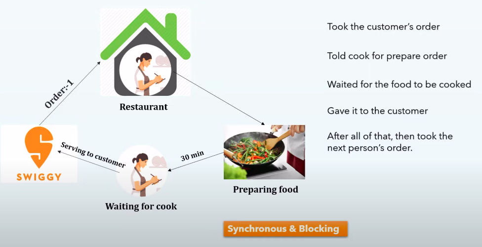
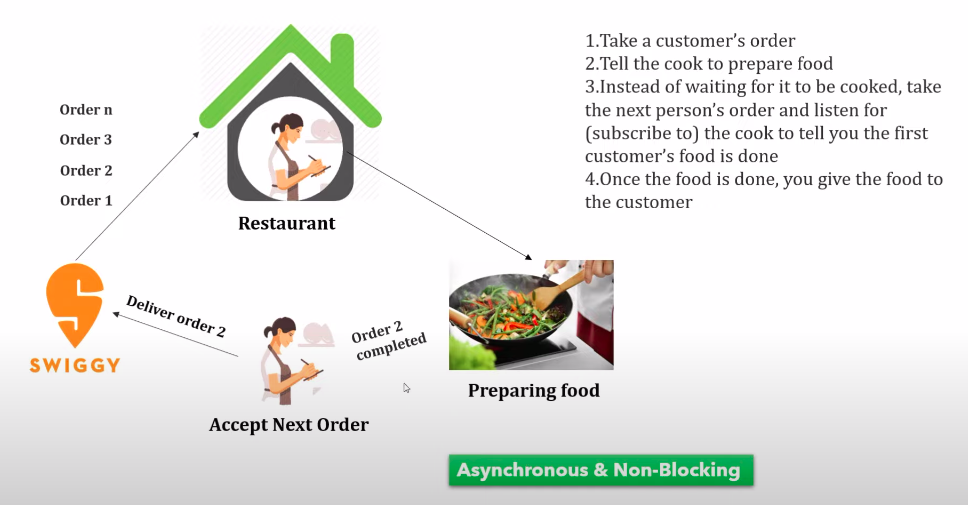
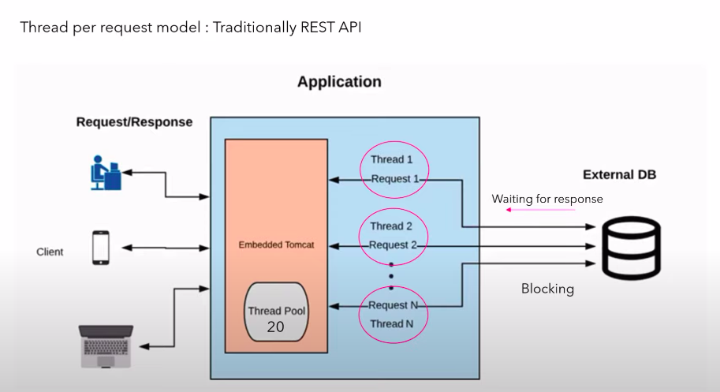
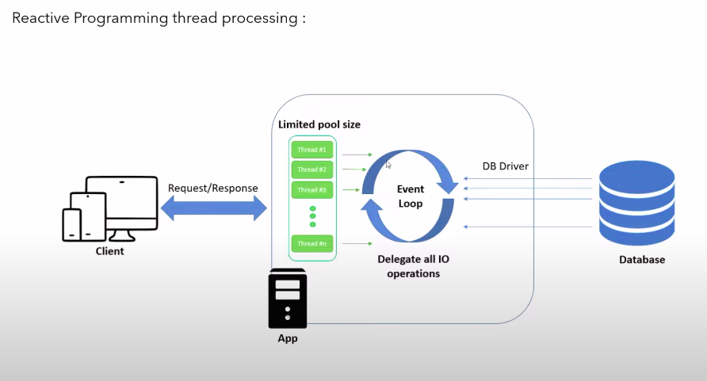
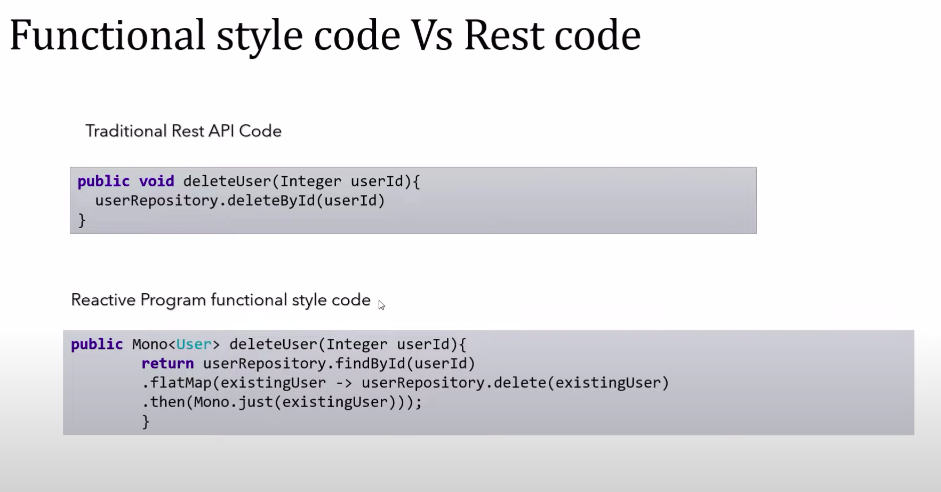

# Java Reactive Programming

**Core Features**

1. New Programming Paradigm
2. Asynchronous and Non-Blocking
3. Functional Style Coding
4. Data Flow as Event Driven Stream
5. Backpressure on Data Stream

**Former Approach**

**Optimized Approach**

**Thread Per Request Model**

**Reactive Programming Model**

**Functional Vs RestCode**

