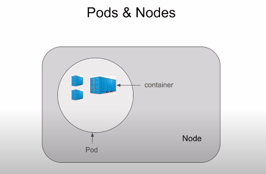

# Kubernetes

A container orchestration tool to manage Microservices running on a number of Containers.

*Docker only Creates the Containers.*

**Tasks**

1. Deploying
2. Scheduling
3. Scaling
4. Load Ballancing
5. Batch Execution
6. Roll-Backs
7. Monitoring

**Pods and Nodes**

**Features of K8S**

1. Automatic Bin Packing : Suppose we have 5 servers each having 10GB of memory. We have a list of jobs to run on these 5 servers. Every job has a difference resource requirement.

Kubernetes will take care of packaging these jobs in bins in the **most efficient way**.

*Packing the jobs into as few bins as possible is the most efficient way.*

Kubernetes automatically takes care of this while not sacrificing availability saves resources.

*We can optionally specify how much CPU and Memory each container needs.*

2. Service Discovery and Load Balancing

How K8S organizes containers : K8S doesn't run Containers directly instead it wraps one or more containers into a higher-level structure called a Pod.

**A Pod Contains**

1. An application Container
2. Storage Resource
3. A Unique IP

*A single DNS Name(service) can have multiple Pods.*

Thus K8S can take over a network and provide Load Ballancing Services.

3. Storage Orchestration

Containers running inside a pod may need to store data
Pods can have a storage volumes

K8S allows to mount the storage system of your choice:
    1. Local
    2. Cloud
    3. Network

4. Self Healing

If container fails -> K8S will restart the Container
If Node dies -> K8S will replace and reschedule containers on the other node.

K8S has a monitoring system, user defined health check

5. Automated Rollout and and Rollbacks

Rollout = Deploying changes to the applications
Rollback= Revert the Changes and Restore to previous state

6. Secret and Configuration Management

Secret : 
    1. Sensitive data like Passwords, Keys, Tokens etc.
    2. Secret is a K8S object
    3. Created outside pods and containers
    4. Makes sensitive data portable and easy to handle
    5. Seperates sensitive data from Pods

Config Map :
    1. For the management of Configuration
    2. Config Map is a K8S object
    3. Created outside Pods & Containers
    4. Makes Configurations portable and easy to manage
    5. Seperates configuration data from Pods

*Secrets and Configurations are stored in ETCD a key-value datastore(database), max size for a Secret is 1 MB*

7. Batch Execution :

    1. Requires an executable/process to be run to completion. In K8S to run to completion jobs are primarily used for Batch Processing.
    2. Each Job can create one or more pods.
    3. If the Pod fails, Job controller will reschedule the container to another node.
    4. Cn run multiple pods in parallel and can scale up if required.

    5. Once the job is completed the pods will move from running state to shut-down state.

8. Horizontal Scaling :

Scale Up = To Create More replicas of the Containers
Scale Down=To Destory the Containers that are not required

Can be acheived by Commands, UIs and even automatic CPU usage by Configurations

